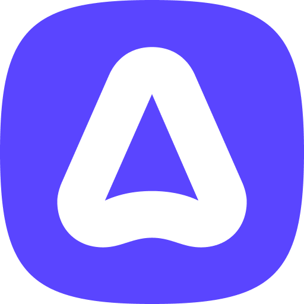
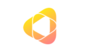
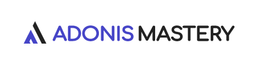
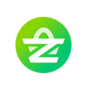
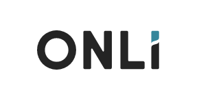
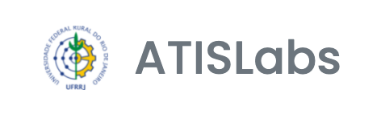
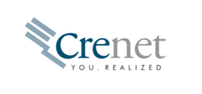
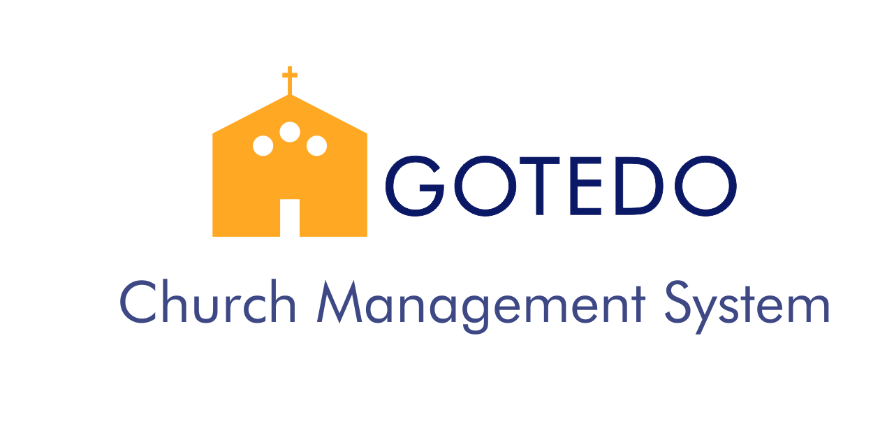

# Awesome AdonisJS 

> This is a carefully curated list of awesome [AdonisJS](https://adonisjs.com) resources :star2:

**AdonisJS** is a fully featured web framework for Node.js. It includes everything you need to create a fully functional web app or an API server.

---

 

*We would like to thank [Zura Gabievi](https://github.com/zgabievi) for maintaining this repo for repos and transferring it to the core team.*

## Essentials

- [AdonisJS official website](http://adonisjs.com)
- [AdonisJS documentation](http://docs.adonisjs.com)
- [AdonisJS github](https://github.com/adonisjs)
- [AdonisJS discussions forum](https://github.com/adonisjs/core/discussions)
- [AdonisJS twitter](https://twitter.com/adonisframework)

## Packages

- [AdonisJS Firebase Cloud Messaging](https://github.com/lookinlab/adonis-fcm) – The wrapper for send messages to Firebase Cloud Messaging
- [AdonisJS Lucid Filter](https://github.com/lookinlab/adonis-lucid-filter) – Addon for filtering AdonisJS Lucid ORM
- [AdonisJS Inertia Provider](https://github.com/eidellev/inertiajs-adonisjs) - Allows you to build server-driven single page apps using [Inertia.js](https://inertiajs.com/)
- [Adonis Class Validator](https://github.com/tnkemdilim/adonis-class-validator) - Adonis Class Validator provides a means to validate a request data using a class based schema
- [Adonis Mix Asset](https://github.com/wahyubucil/adonis-mix-asset) - Adonis Mix Asset is an assets bundler based on Laravel Mix for AdonisJS application
- [Adonis Bull](https://github.com/Rocketseat/adonis-bull/tree/alpha) - A bull queue provider for AdonisJS applications
- [Adonis Stripe](https://github.com/mezielabs/adonis-stripe) - This package makes it seamless to work with Stripe in AdonisJS 5 applications.
- [Adonis Swagger](https://github.com/reg2005/adonis5-swagger) - Swagger for Adonis 5
- [Adonis Sentry](https://github.com/reg2005/adonis5-sentry) - Sentry for Adonis 5
- [Adonis Cache](https://github.com/reg2005/adonis5-cache) - Cache provider for Adonis 5.
- [Adonis BullMQ](https://github.com/reg2005/adonis5-bullmq) - Simple BullMQ provider for you own queue commands
- [Adonis Request throttler](https://github.com/reg2005/adonis-request-throttler) - Middleware for Request throttling

## Articles, tutorials, and blog posts

- [Adonis V5 (MongoDB) provider](https://mcsneaky.ap3k.pro/posts/adonis-v5-provider/) - An article covering how to use MongoDB in your AdonisJS projects
- [Set up TailwindCSS using the default Encore package](https://ivanprats.dev/blog/set-up-tailwindcss-in-new-adonis5/) - A quick article explaining what dependencies to install and configuration to add to set up TailwindCSS in a Adonis 5 application, using the default Webpack Encore package for assets management.

## Videos and courses

- [Let's learn AdonisJS](https://jagr.co/series/lets-learn-adonis-5) - A series for screencasts to learn the framework from scratch
- [Using MJML with AdonisJS](https://www.youtube.com/watch?v=zehb-qUzRCM) - A screencast showcasing how to use MJML markup language with the AdonisJS mailer
- [AdonisJS 5 From Scratch](https://adonismastery.com/courses/adonisjs-5-from-scratch) - A project-based course, where you get to learn AdonisJS 5 by building. We'll cover each aspect of the framework while we gradually build a tasks application.
- [Authentication with multiple IDs in AdonisJS 5](https://adonismastery.com/watch/authentication-with-multiple-ids-in-adonisjs-5) - A screencast showing how to allow users to log in with multiple IDs in an AdonisJS 5 application.
- [AdonisJS 5: from preview to stable](https://adonismastery.com/watch/adonisjs-5:-from-preview-to-stable) - A screencast walking you through how to migrate an application built with the preview version of AdonisJS 5 to the stable version of AdonisJS 5.

## Books

## Community

## Miscellaneous

- [Node ace ZSH completions](https://github.com/romch007/node-ace-zsh-completion) - ZSH completions for the node ace commandline
- [Youtube Downloader](https://gitlab.com/McSneaky/youtube-downloader) - Youtube video and audio downloader as example project featuring dockerizing, response streaming and Gitlab CI automatic build + deploy
- [Akpoho Invoicing Software](https://github.com/ndianabasi/akpoho-invoicing-software) - An open-source SaaS-grade application which provides invoicing, quotations, and receipts functionalities for small businesses. Akpoho Software is built with the amazing AdonisJS 5 as the backend, so you can study the source codes and learn how to build your SaaS application with AdonisJS.

## Companies/Projects using AdonisJS

<table>
  <tbody>
    <tr>
      <td></td>
      <td><a href="https://cleavr.io/">https://cleavr.io/</a></td>
    </tr>
    <tr>
      <td></td>
      <td><a href="https://doclify.io/">https://doclify.io/</a></td>
    </tr>
    <tr>
      <td></td>
      <td><a href="https://cavai.com/">https://cavai.com/</a></td>
    </tr>
    <tr>
      <td></td>
      <td><a href="http://kayako.com/">http://kayako.com/</a></td>
    </tr>
    <tr>
      <td></td>
      <td><a href="https://paytm.com/">https://paytm.com/</a></td>
    </tr>
    <tr>
      <td></td>
      <td><a href="https://pettysave.com/">https://pettysave.com/</a></td>
    </tr>
    <tr>
      <td></td>
      <td><a href="https://voyagerportal.com/">https://voyagerportal.com/</a></td>
    </tr>
    <tr>
      <td></td>
      <td><a href="https://askyourpharmacist.ca/">https://askyourpharmacist.ca/</a></td>
    </tr>
    <tr>
      <td></td>
      <td><a href="https://adonismastery.com">https://adonismastery.com</a></td>
    </tr>
    <tr>
      <td></td>
      <td><a href="http://zaychin.com">http://zaychin.com</a></td>
    </tr>
    <tr>
      <td></td>
      <td><a href="https://medicalworldnigeria.com">https://medicalworldnigeria.com</a></td>
    </tr>
    <tr>
      <td></td>
      <td><a href="https://www.onli.com.br">https://www.onli.com.br</a></td>
    </tr>
    <tr>
      <td></td>
      <td><a href="https://tools.atislabs.com.br/covid">https://tools.atislabs.com.br/covid</a></td>
    </tr>
    <tr>
      <td></td>
      <td><a href="https://www.adeo.com/en/adeo/key-figures">https://www.adeo.com/en/adeo/key-figures</a></td>
    </tr>
    <tr>
      <td></td>
      <td><a href="https://www.leroymerlin.com/">https://www.leroymerlin.com/</a></td>
    </tr>
    <tr>
      <td></td>
      <td><a href="https://www.crenet.io">https://www.crenet.io</a></td>
    </tr>
    <tr>
      <td></td>
      <td><a href="https://gotedo.com">Gotedo Church Management Software</a></td>
    </tr>
  </tbody>
</table>

## Contributing

Want to contribute with some resource? Great! Please, read the [contribution guidelines](CONTRIBUTING.md) before contributing.

## License

